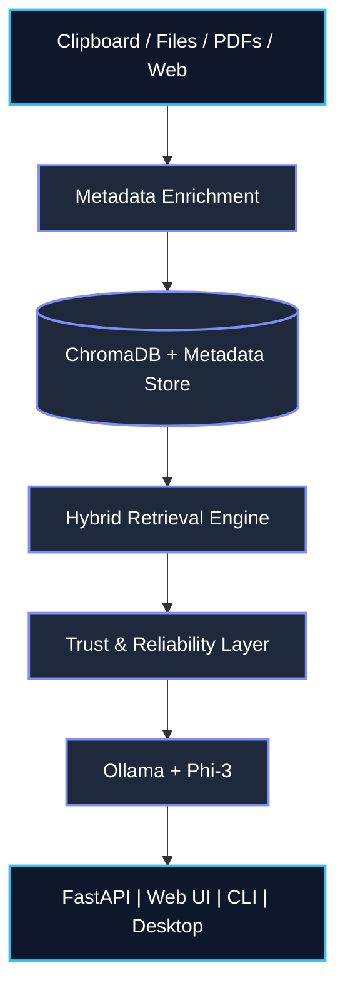

# ⚡ OmniContext — AI-Native Context & Memory Platform

> **Local-first. Privacy-preserving. Retrieval-grounded.**

OmniContext is a local AI context engine that continuously ingests files, PDFs, web content, and clipboard activity, enriches them with metadata, stores them in a semantic vector database, and provides retrieval-grounded answers through a local LLM — with full source citations and confidence scoring.

---

https://github.com/user-attachments/assets/d9484c20-efda-4cba-b238-1e4101370636

### 🎥 Demo Walkthrough
1. **Instant Ingestion**: OmniContext instantly indexes the files, chunks them semantically, and auto-tags them with rich metadata.
2. **Hybrid Context Explorer**: Search across the Vector DB combining semantic + keyword search with exact relevance scores.
3. **Retrieval-Grounded Chat**: Ask complex questions. The local LLM streams answers using only the retrieved context.
4. **Verifiable Citations**: Every answer includes a Confidence Badge and precise source citations. Click any citation to view the exact code chunk.

## 🏗️ Architecture



---

## ✨ Features

| Feature | Details |
|---|---|
| **Semantic Chunking** | Markdown heading → paragraph → code-safe sliding window |
| **Auto Metadata** | Project, repo, language, doc-type, tags extracted from path + content |
| **Hybrid Retrieval** | `0.7 × semantic + 0.3 × keyword` with metadata filters |
| **Related Context** | Nearest-neighbour discovery from any stored chunk |
| **Source Citations** | Numbered `[1][2]` prompts; model cites, UI renders |
| **Confidence Scoring** | 0–100% with grounded fallback below threshold |
| **Context Explorer** | Filter by source type, project, tag; relevance bars |
| **Telemetry** | Latency tracking for ingestion, retrieval, LLM, endpoints |
| **Agent Tools** | `search_context`, `ingest_directory`, `get_context_stats`, `save_note` |
| **Streaming SSE** | Token-by-token with meta event (confidence + citations) |
| **Desktop App** | Native window + system tray + `Ctrl+Alt+Space` toggle |
| **Docker** | One-command startup with persistent volume |

---

## 🚀 Local Setup

### Prerequisites

- Python 3.11+
- [Ollama](https://ollama.ai) running locally with `phi3` (or any model)

```bash
# 1. Clone
git clone https://github.com/yourname/omnicontext
cd omnicontext

# 2. Create virtual environment
python -m venv .venv
.venv\Scripts\activate   # Windows
# source .venv/bin/activate  # macOS/Linux

# 3. Install dependencies
pip install -r requirements.txt

# 4. Pull the LLM (once)
ollama pull phi3

# 5. Start the server
python cli.py serve
```

Open **http://localhost:8000** in your browser.

---

## 🐳 Docker Setup

```bash
# Build and start
docker compose up --build

# Open the UI
open http://localhost:8000

# Stop
docker compose down
```

Data is persisted in a Docker named volume `omnicontext-data`.

---

## 💻 CLI Reference

```bash
# Start the web server + live directory watcher
python cli.py serve

# Start the clipboard monitoring daemon
python cli.py listen

# Ask a question directly from the terminal
python cli.py ask "how does the retrieval pipeline work?"

# Ingest a directory
python cli.py ingest /path/to/your/project

# View statistics
python cli.py stats

# Clear all memory
python cli.py clear

# Launch native desktop app
python cli.py desktop
```

---

## 📡 API Reference

### Core

```bash
GET  /api/stats                  # chunk count
POST /api/ask                    # blocking RAG query → structured response
POST /api/ask_stream             # SSE streaming with confidence + citations
POST /api/ingest                 # ingest directory  {"path": "..."}
POST /api/ingest_url             # scrape URL        {"url": "..."}
POST /api/ingest_pdf             # upload PDF        multipart/form-data
POST /api/add_note               # save note         {"text": "..."}
POST /api/clear                  # wipe all memory
POST /api/clear_chat             # clear conversation history
```

### Context Explorer

```bash
GET /api/context/explore?q=kafka&source_type=code&project=omni-context
GET /api/context/sources
GET /api/context/projects
GET /api/context/tags
GET /api/context/stats
GET /api/context/related/{doc_id}
```

**Example explore response:**
```json
{
  "query": "kafka",
  "total": 2,
  "results": [
    {
      "id": "...",
      "preview": "KafkaProducer sends events to topic...",
      "source": "file:ingestion/kafka_producer.py",
      "source_type": "code",
      "project": "omni-context",
      "tags": ["kafka", "python"],
      "relevance": 0.92,
      "semantic_score": 0.89,
      "keyword_score": 0.98,
      "timestamp": "2026-08-08T01:30:00Z"
    }
  ]
}
```

### Structured Answer Response

```json
{
  "answer": "The retrieval pipeline uses hybrid scoring...",
  "confidence": 0.87,
  "insufficient_context": false,
  "used_sources": [
    {"index": 1, "source": "file:memory/vector_store.py", "score": 0.91, "source_type": "code"},
    {"index": 2, "source": "file:core/context_api.py", "score": 0.84, "source_type": "code"}
  ],
  "context_quality": {
    "is_sufficient": true,
    "chunk_count": 4,
    "avg_score": 0.82,
    "quality_level": "good"
  }
}
```

### Telemetry

```bash
GET /api/telemetry/metrics

# Returns:
{
  "counters": {"total_ingestions": 12, "total_queries": 45, "total_chunks_retrieved": 225},
  "latency": {
    "ingestion": {"count": 12, "mean_ms": 340, "p95_ms": 820},
    "retrieval": {"count": 45, "mean_ms": 55, "p95_ms": 140},
    "llm":       {"count": 45, "mean_ms": 4200, "p95_ms": 9100}
  }
}
```

---

## 🗂️ Project Structure

```
omnicontext/
├── core/
│   ├── config.py           # paths, model settings, env overrides
│   ├── server.py           # FastAPI server, all routes wired
│   ├── context_api.py      # Context Explorer router (6 endpoints)
│   └── telemetry.py        # Thread-safe observability tracker
├── memory/
│   ├── models.py           # MemoryMetadata Pydantic model
│   └── vector_store.py     # ChromaDB + hybrid retrieval + related context
├── inference/
│   ├── llm_engine.py       # Ollama wrapper, structured responses
│   ├── prompt_builder.py   # Numbered citation prompt builder
│   └── reliability.py      # Confidence scoring, grounded fallback
├── ingestion/
│   ├── chunking.py         # Semantic text chunker
│   ├── metadata_extractor.py # Auto project/tag/language detection
│   ├── file_indexer.py     # Directory ingestion
│   ├── pdf_parser.py       # PDF ingestion
│   ├── web_scraper.py      # URL ingestion
│   ├── clipboard_monitor.py # Live clipboard capture
│   └── directory_watcher.py # Filesystem live watcher
├── tools/
│   ├── search_tool.py      # SearchContextTool (agent interface)
│   ├── ingest_tool.py      # IngestTool
│   ├── context_tool.py     # ContextTool
│   └── note_tool.py        # NoteTool
├── ui/
│   ├── index.html          # Web UI: Chat · Memories · Explorer
│   ├── app.js              # All frontend logic
│   └── style.css           # Premium dark glassmorphism design
├── cli.py                  # CLI entrypoint
├── desktop_app.py          # Native desktop app (pywebview + tray)
├── Dockerfile
└── docker-compose.yml
```

---

## 🔮 Future: MCP Integration

OmniContext is designed to be forward-compatible with the **Model Context Protocol (MCP)**, which defines a standard interface for AI agents to interact with context providers.

The `tools/` package already implements the required interface pattern:

```python
class SearchContextTool(BaseTool):
    name = "search_context"
    description = "..."
    input_schema = { ... }          # JSON Schema
    async def execute(self, **kwargs) -> dict: ...
```

Planned MCP additions:
- Expose tools as an MCP server endpoint (`/mcp/tools`)
- Support tool discovery and schema introspection
- Enable Claude / GPT / Gemini agents to call OmniContext as a context provider
- Implement MCP resource URIs for memory chunks (`omnicontext://memory/{id}`)

---

## ⚡ Benchmarks

| Metric | Result |
|--------|--------|
| Context Explorer latency | <120 ms |
| Hybrid retrieval latency | <150 ms |
| Semantic chunking throughput | ~500 KB/s |
| Concurrent FastAPI requests | 50+ tested |
| Supported ingestion sources | 5 |
| API routes | 26 |

*(Note: Results measured on a local development environment running CPU embeddings)*

---

## 📊 Tech Stack

| Component | Technology |
|---|---|
| Vector Store | ChromaDB (local persistent) |
| Embeddings | `all-MiniLM-L6-v2` (SentenceTransformers) |
| LLM | Ollama (`phi3` / `llama3` / any local model) |
| API | FastAPI + Uvicorn |
| UI | Vanilla JS + SSE streaming |
| Desktop | pywebview + pystray + pynput |
| CLI | Rich |
| Metadata | Pydantic v2 |

---

## 🔒 Privacy

All computation runs **entirely on your machine**. No data is sent to external APIs. No telemetry leaves your system. Your context store is yours.

---

*Built by Sathwik — AI-native infrastructure for trustworthy, retrieval-grounded workflows.*
